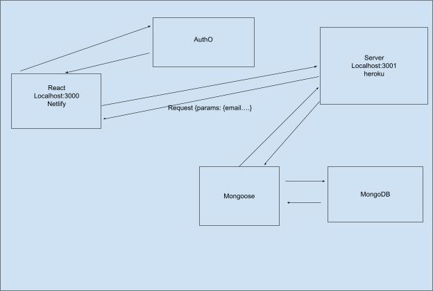

# Project Name Best Books Back End

**Author**: Ellis Yoo, Elijah Prom
**Version**: 1.0.0

## Overview

Creating a back end server that stores data into mongoDB for the front end best books app

## Getting Started

install all dependencies.

## Architecture

express, cors, dotenv, mongoose, nodemon

## Change Log

03-30-21 2:18pm - Application now has a fully-functional express server, with a GET route for the location resource.

03-31-21 6:30 - Application can now add and delete books

04-01-21 4:45 = Application can now update books

## Credit and Collaborations

Lena instructor. MongoDB docs

### Name of feature: created back end with routes to books

Estimate of time needed to complete: 4 hours

Start time: 1:30pm

Finish time: 2:20pm

Actual time needed to complete: 50 minutes

### Name of feature: Allow to create books

Estimate of time needed to complete: 2 hours

Start time: 1:00pm

Finish time: 1:30 pm
Actual time needed to complete: 30 min

### Name of feature: Allow to delete books

Estimate of time needed to complete: 2 hours

Start time: 4:00pm

Finish time: 6:30 pm
Actual time needed to complete: 2.5hrs

### Name of feature: Allow to update books

Estimate of time needed to complete: 3 hours

Start time: 1:15pm

Finish time: 4:45 pm
Actual time needed to complete: 3.5hrs